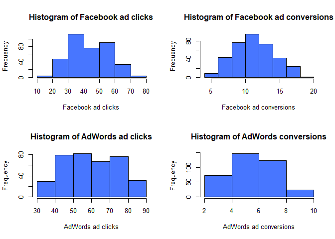

Marketing Analytics
================
Leilane Cambara
2024-04-25

## Introduction

This small report uses the dataset provided in Meta’s course
[“Statistics for
Marketing”](https://www.coursera.org/learn/statistics-for-marketing/) on
Coursera to replicate its capstone project using R. (Originally, it is
done in Google Sheets.)

The dataset contains daily data for marketing campaigns on both Facebook
and AdWords. For each platform, there is data for the number of views,
number of clicks, number of conversions, cost per ad, click-though rate
(clicks/view), conversion rate (conversions/clicks) and cost per click
(ad cost/clicks).

Here, I look into the number of clicks and conversions and conclude that
**ads on the Facebook platform have more conversions than on AdWords**.

## Descriptive statistics

First, I load the necessary packages and the data:

``` r
library(readxl)
library(dplyr)
library(ggplot2)
library(knitr)

marketing <- read_excel("~/GitHub/marketing-analytics/meta-marketing-analytics.xlsx")
```

And find the descriptive statistics and histograms of the variables of
interest:

``` r
stats_fb_clicks <- marketing %>%
  summarise(mean = mean(facebook_ad_clicks), sd = sd(facebook_ad_clicks), median = median(facebook_ad_clicks), min = min(facebook_ad_clicks), max = max(facebook_ad_clicks))

stats_fb_conversions <- marketing %>%
  summarise(mean = mean(facebook_ad_conversions), sd = sd(facebook_ad_conversions), median = median(facebook_ad_conversions), min = min(facebook_ad_conversions), max = max(facebook_ad_conversions))

stats_aw_clicks <- marketing %>%
  summarise(mean = mean(adwords_ad_clicks), sd = sd(adwords_ad_clicks), median = median(adwords_ad_clicks), min = min(adwords_ad_clicks), max = max(adwords_ad_clicks))

stats_aw_conversions <- marketing %>%
  summarise(mean = mean(adwords_ad_conversions), sd = sd(adwords_ad_conversions), median = median(adwords_ad_conversions), min = min(adwords_ad_conversions), max = max(adwords_ad_conversions))

stats <- as.data.frame(rbind(stats_fb_clicks, stats_fb_conversions, stats_aw_clicks, stats_aw_conversions))

rownames <- c("Facebook clicks", "Facebook conversions", "AdWords clicks", "AdWords conversions")
rownames(stats) <- rownames

kable(stats)
```

|                      |      mean |        sd | median | min | max |
|:---------------------|----------:|----------:|-------:|----:|----:|
| Facebook clicks      | 44.049315 | 12.140559 |     43 |  15 |  73 |
| Facebook conversions | 11.742466 |  2.924786 |     12 |   5 |  19 |
| AdWords clicks       | 60.383562 | 14.368225 |     60 |  31 |  89 |
| AdWords conversions  |  5.980822 |  1.628106 |      6 |   3 |   9 |

``` r
par(mfrow=c(2,2))
hist(unlist(marketing["facebook_ad_clicks"]), breaks = 7, main = "Histogram of Facebook ad clicks", xlab = "Facebook ad clicks", col = "royalblue1")
hist(unlist(marketing["facebook_ad_conversions"]), breaks = 8, main = "Histogram of Facebook ad conversions", xlab = "Facebook ad conversions", col = "royalblue1")
hist(unlist(marketing["adwords_ad_clicks"]), breaks = 6, main = "Histogram of AdWords ad clicks", xlab = "AdWords ad clicks", col = "royalblue1")
hist(unlist(marketing["adwords_ad_conversions"]), breaks = 4, main = "Histogram of AdWords conversions", xlab = "AdWords ad conversions", col = "royalblue1")
```

<!-- -->

We can see that ads on AdWords receive more clicks on average, ~60.38,
than ads on Facebook, ~44.05. However, the opposite is true for
conversions. The average conversion of AdWords ads, ~5.98, is almost
half of Facebook ads, ~11.74. While this suggests that the conversion is
higher on the Facebook platform, we still need to formally test this.

### Correlation between clicks and conversions

It is interesting to notice that the correlation between clicks and
conversions varies considerably with the platform. The correlation is
positive on both platforms, but on AdWords, it is much weaker than on
Facebook.

#### Facebook campaigns

``` r
kable(cor(marketing["facebook_ad_clicks"], marketing["facebook_ad_conversions"]))
```

|                    | facebook_ad_conversions |
|:-------------------|------------------------:|
| facebook_ad_clicks |                0.873775 |

``` r
kable(cor(marketing["adwords_ad_clicks"], marketing["adwords_ad_conversions"]))
```

|                   | adwords_ad_conversions |
|:------------------|-----------------------:|
| adwords_ad_clicks |              0.4479932 |

``` r
par(mfrow=c(1,2))
plot(unlist(marketing["facebook_ad_clicks"]), unlist(marketing["facebook_ad_conversions"]), col = "royalblue1", pch = 20, xlab = "Clicks", ylab = "Conversions", main = "Facebook ads")
plot(unlist(marketing["adwords_ad_clicks"]), unlist(marketing["adwords_ad_conversions"]), col = "royalblue1", pch = 20, xlab = "Clicks", ylab = "Conversions", main = "AdWords ads")
```

<!-- -->

## A/B Test

We want to test whether there is a difference between the number of
conversions on the Facebook platform versus the AdWords platform
(**evaluation question**). For that, we formulate the **hypothesis**
that ad conversions will be higher on Facebook than on AdWords, such
that:

**H0:** there is no statistical difference between the ad conversions in
the two platforms.

**H1:** there is a statistical difference between the ad conversions in
the two platforms.

The **alpha** is set to 0.05.

In this case, the A/B test is a two-tailed t-test for independent
samples.

``` r
t.test(unlist(marketing["facebook_ad_conversions"]), unlist(marketing["adwords_ad_conversions"]))
```

    ## 
    ##  Welch Two Sample t-test
    ## 
    ## data:  unlist(marketing["facebook_ad_conversions"]) and unlist(marketing["adwords_ad_conversions"])
    ## t = 32.884, df = 569.82, p-value < 2.2e-16
    ## alternative hypothesis: true difference in means is not equal to 0
    ## 95 percent confidence interval:
    ##  5.417506 6.105782
    ## sample estimates:
    ## mean of x mean of y 
    ## 11.742466  5.980822

The p-value is less than 0.05 (since it is less than 2.2e-16), such that
we reject the null hypothesis of no difference between the ad
conversions in the two platforms and accept the alternative hypothesis
of a statistical difference between them. Hence, we conclude that the
mean conversions on the Facebook platform is higher that on AdWords.
